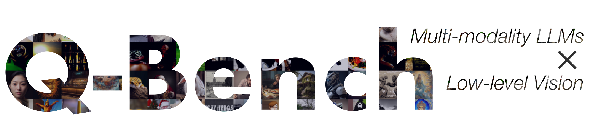
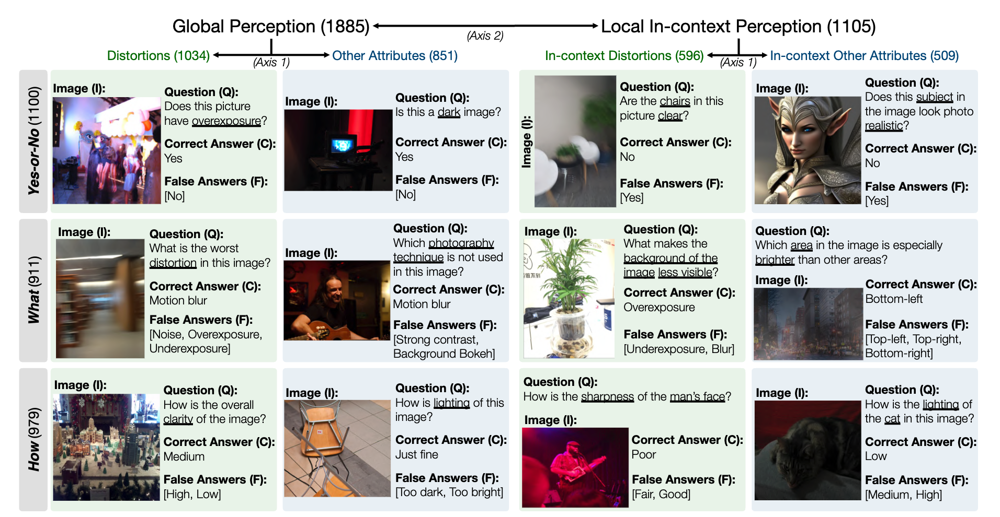

<div align="center">
    
    
 <div>

<a href="https://github.com/Q-Future/"></a>
    <a href="https://github.com/Q-Future/Q-Bench"></a>
    <a href="https://arxiv.org/abs/2309.14181"></a>
    <a href="https://arxiv.org/abs/2402.07116"></a>
    <a href="https://github.com/Q-Future/Q-Bench/releases/tag/v1.0.1.1014datarelease"></a>
    <a href="https://github.com/Q-Future/Q-Instruct"></a>
   </div>


  <h1>Q-Bench: A Benchmark for General-Purpose Foundation Models on Low-level Vision</h1>

_How do multi-modaility LLMs perform on low-level computer vision?_


  <div>
      <a href="https://teowu.github.io/" target="_blank">Haoning Wu</a><sup>1</sup><sup>*</sup>,
      <a href="https://zzc-1998.github.io/" target="_blank">Zicheng Zhang</a><sup>2</sup><sup>*</sup>,
      <a href="https://github.com/ZhangErliCarl/" target="_blank">Erli Zhang</a><sup>1</sup><sup>*</sup>,
      <a href="https://chaofengc.github.io" target="_blank">Chaofeng Chen</a><sup>1</sup>,
      <a href="https://liaoliang92.github.io" target="_blank">Liang Liao</a><sup>1</sup>,
  </div>

<div>
      <a href="https://github.com/AnnanWangDaniel" target="_blank">Annan Wang</a><sup>1</sup>,
      <a href="https://github.com/lcysyzxdxc" target="_blank">Chunyi Li</a><sup>2</sup>,
      <a href="https://wenxiusun.com" target="_blank">Wenxiu Sun</a><sup>3</sup>,
      <a href="https://scholar.google.com/citations?user=uT9CtPYAAAAJ&hl=en" target="_blank">Qiong Yan</a><sup>3</sup>,
      <a href="https://ee.sjtu.edu.cn/en/FacultyDetail.aspx?id=24&infoid=153&flag=153" target="_blank">Guangtao Zhai</a><sup>2</sup>,
      <a href="https://personal.ntu.edu.sg/wslin/Home.html" target="_blank">Weisi Lin</a><sup>1</sup><sup>#</sup>
  </div>
  <div>
  <sup>1</sup>Nanyang Technological University, <sup>2</sup>Shanghai Jiaotong University, <sup>3</sup>Sensetime Research
       </div>   
<div>
<sup>*</sup>Equal contribution. <sup>#</sup>Corresponding author. 
   </div>
    
<div>
We are accepted as an ICLR2024 Spotlight. See you in Vienna!
   </div>
<a href="https://arxiv.org/abs/2309.14181"><strong>Paper</strong></a> |
<a href="https://q-future.github.io/Q-Bench"><strong>Project Page</strong></a> |
<a href="https://github.com/Q-Future/Q-Bench"><strong>Github</strong></a> |
 <a href="https://huggingface.co/datasets/nanyangtu/LLVisionQA-QBench"><strong>Data (LLVisionQA)</strong></a> |
 <a href="https://huggingface.co/datasets/nanyangtu/LLDescribe-QBench"><strong>Data (LLDescribe)</strong></a> |
<a href="https://q-future.github.io/Chinese-Q-Bench"><strong>质衡 (Chinese-Q-Bench)</strong></a>


    
    
  <div style="width: 80%; text-align: center; margin:auto;">
      
  </div>
    

  <div style="width: 80%; text-align: center; margin:auto;">
      
  </div>
    


</div>

The proposed Q-Bench includes three realms for low-level vision: perception (A1), description (A2), and assessment (A3).

- For perception (A1) /description (A2), we collect two benchmark datasets LLVisionQA/LLDescribe.
- We are open to **submission-based evaluation** for the two tasks. The details for submission is as follows.
- For assessment (A3), as we use **public datasets**, we provide an abstract evaluation code for arbitrary MLLMs for anyone to test.

## Release
- [2024/6/17]🔥 The **Q-Bench**, **Q-Bench2**([Q-bench+](https://arxiv.org/abs/2402.07116)), and [**A-Bench**](https://github.com/Q-Future/A-Bench) have now joined [lmm-eval](https://github.com/EvolvingLMMs-Lab/lmms-eval), which makes it easier to test LMM !!
- [2024/6/3] 🔥 [Github repo](https://github.com/Q-Future/A-Bench) for **A-Bench** is online. Do you want to find out if your LMM is a master at evaluating AI-generated images? Come and test on **A-Bench** !!
- [3/1]  🔥 We are releasing **Co-instruct**, *Towards Open-ended Visual Quality Comparison* [here](https://co-instruct.github.io/). More details are coming soon.
- [2/27] 🔥 Our work **Q-Insturct** has been accepted by CVPR 2024, try to learn the [details](https://github.com/Q-Future/Q-Instruct) about how to instruct MLLMs on low-level vision!
- [2/23] 🔥 The low-level vision compare task part of [Q-bench+](https://arxiv.org/abs/2402.07116) is now released at [Q-bench+(Dataset)](https://huggingface.co/datasets/q-future/q-bench2)!
- [2/10] 🔥 We are releasing the extended [Q-bench+](https://arxiv.org/abs/2402.07116), which challenges MLLMs with both single images and **image pairs** on low-level vision. The [LeaderBoard](https://huggingface.co/spaces/q-future/Q-Bench-Leaderboard) is onsite, check out the low-level vision ability for your favorite MLLMs!! More details coming soon.
- [1/16] 🔥 Our work ["Q-Bench: A Benchmark for General-Purpose Foundation Models on Low-level Vision"](https://arxiv.org/abs/2309.14181) is accepted by **ICLR2024 as Spotlight Presentation**.
  
## Close-source MLLMs (GPT-4V-Turbo, Gemini, Qwen-VL-Plus, GPT-4V)

  <div style="width: 55%; text-align: center; margin:auto;">
      
  </div>

We test on three close-source API models, GPT-4V-Turbo (`gpt-4-vision-preview`, replacing the no-longer-available *old version* GPT-4V results), Gemini Pro (`gemini-pro-vision`) and Qwen-VL-Plus (`qwen-vl-plus`). Slightly improved compared with the older version, GPT-4V still tops among all MLLMs and almost a junior-level human's performance. Gemini Pro and Qwen-VL-Plus follows behind, still better than best open-source MLLMs (0.65 overall).


|**Participant Name** | yes-or-no | what | how | distortion | others | in-context distortion | in-context others | overall |
| - | - | - | - | - | - | -| - | - | 
| Qwen-VL-Plus (`qwen-vl-plus`) | 0.7574 |  0.7325 |  0.5733|  0.6488 | 0.7324 | 0.6867 | 0.7056 | 0.6893 |
| Gemini-Pro (`gemini-pro-vision`) | 0.7221 |  0.7300 |0.6645 | 0.6530 | 0.7291 | 0.7082 | 0.7665 | 0.7058 |
| GPT-4V-Turbo (`gpt-4-vision-preview`) |0.7722 | 0.7839 | 0.6645 |0.7101 | 0.7107 | 0.7936 | 0.7891  | 0.7410 |
| GPT-4V (*old version*) | 0.7792 | 0.7918 | 0.6268 | 0.7058 | 0.7303 | 0.7466 | 0.7795 | 0.7336   |
| human-1-junior | 0.8248 | 0.7939 | 0.6029 | 0.7562 | 0.7208 | 0.7637 | 0.7300 | 0.7431   |
| human-2-senior | **0.8431** | **0.8894** | **0.7202** | **0.7965** | **0.7947** | **0.8390** | **0.8707** | **0.8174**  |

We have also evaluated several new open-source models recently, and will release their results soon.


## Submission Guideline for A1/A2

### Option 1: Submit Results

#### Step 1: Download Images

We now provide two ways to download the datasets (LLVisionQA\&LLDescribe)

- via GitHub Release: Please see our [release](https://github.com/Q-Future/Q-Bench/releases/tag/v1.0.1.1014datarelease) for details.

- via Huggingface Datasets: Please refer to the [data release notes](/data_release) to download the images.

#### Step 2: Test with Your Model

It is highly recommended to convert your model into Huggingface format to smoothly test these data. See the [example scripts for Huggingface's IDEFICS-9B-Instruct](/example_code_for_idefics) as an example, and modify them for your custom model to test on your model.


**Please email `haoning001@e.ntu.edu.sg` to submit your result in json format.**


### Option 2: Submit Model

You can also submit your model (could be Huggingface AutoModel or ModelScope AutoModel) to us, alongside your custom evaluation scripts. Your custom scripts can be modified from the [template scripts](https://github.com/haotian-liu/LLaVA/blob/main/llava/eval/model_vqa_qbench.py) that works for LLaVA-v1.5 (for A1/A2), and [here](example_code_for_idefics/a3_assessment_all.py) (for image quality assessment).

**Please email `haoning001@e.ntu.edu.sg` to submit your model if you are _outside_ China Mainland.**
**Please email `zzc1998@sjtu.edu.cn` to submit your model if you are _inside_ China Mainland.**


## A1: Perception

A snapshot for LLVisionQA benchmark dataset for MLLM low-level perception ability is as follows. See the [leaderboard](leaderboards/) here.



We measure the answer accuracy of MLLMs (provided with the question and all choices) as the metric here.

## A2: Description

A snapshot for LLDescribe benchmark dataset for MLLM low-level description ability is as follows. See the [leaderboard](leaderboards/) here.


We measure the _completeness_, _precision_, and _relevance_ of MLLM descriptions as the metric here.

## A3: Assessment

_An exciting ability that MLLMs are able to predict quantitative scores for IQA!_

### Methodology


### Predict a Score

#### Pseudo Code

Similarly as above, as long as a model (based on causal language models) has the following two methods: `embed_image_and_text` (to allow multi-modality inputs), and `forward` (for computing logits), the Image Quality Assessment (IQA) with the model can be achieved as follows:

```python
from PIL import Image
from my_mllm_model import Model, Tokenizer, embed_image_and_text

model, tokenizer = Model(), Tokenizer()

prompt = "##User: Rate the quality of the image.\n" \
         "##Assistant: The quality of the image is" ### This line can be modified based on MLLM's default behaviour.

good_idx, poor_idx = tokenizer(["good","poor"]).tolist()

image = Image.open("image_for_iqa.jpg")
input_embeds = embed_image_and_text(image, prompt)
output_logits = model(input_embeds=input_embeds).logits[0,-1]
q_pred = (output_logits[[good_idx, poor_idx]] / 100).softmax(0)[0]
```

\*Note that you can modify the second line based on your model's default format, _e.g._ for [Shikra](https://github.com/shikras/shikra), the "##Assistant: The quality of the image is" is modified as "##Assistant: The answer is". It is okay if your MLLM will first answer "Ok, I would like to help! The image quality is", just replace this into line 2 of the prompt.

#### Example Real Code for IDEFICS

We further provide a full implementation of IDEFICS on IQA. See [example](example_code_for_idefics/README.md) on how to run IQA with this MLLM. Other MLLMs can also be modified in the same way for use in IQA.

#### Compute SRCC/PLCC with IQA databases

We have prepared JSON format human opinion scores (MOS) for the seven IQA databases as evaluated in our benchmark.

Please see [IQA_databases](a3_iqa_databases/) for details.

### Official Results on IQA Databases

Moved to [leaderboards](leaderboards/). Please click to see details.

## Contact

Please contact any of the first authors of this paper for queries.

- Haoning Wu, `haoning001@e.ntu.edu.sg`, @teowu
- Zicheng Zhang, `zzc1998@sjtu.edu.cn`, @zzc-1998
- Erli Zhang, `ezhang005@e.ntu.edu.sg`, @ZhangErliCarl

## Citation

If you find our work interesting, please feel free to cite our paper:

```bibtex
@inproceedings{wu2024qbench,
    author = {Wu, Haoning and Zhang, Zicheng and Zhang, Erli and Chen, Chaofeng and Liao, Liang and Wang, Annan and Li, Chunyi and Sun, Wenxiu and Yan, Qiong and Zhai, Guangtao and Lin, Weisi},
    title = {Q-Bench: A Benchmark for General-Purpose Foundation Models on Low-level Vision},
    booktitle = {ICLR},
    year = {2024}
}
```
