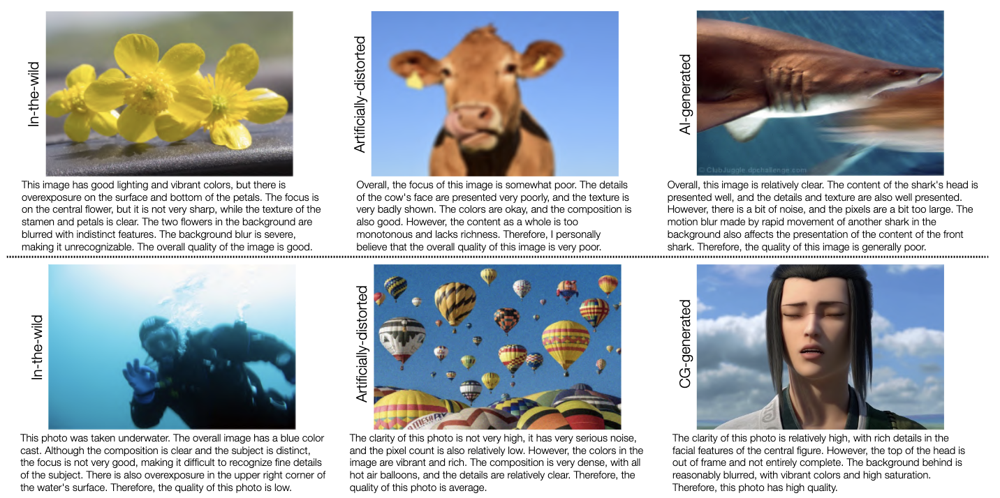

<div align="center">

  <h1>Q-Bench: A Benchmark for General-Purpose Foundation Models on Low-level Vision</h1>

_How do multi-modaility LLMs perform on low-level computer vision?_

  <div>
      <a href="https://teowu.github.io/" target="_blank">Haoning Wu</a><sup>1</sup><sup>*</sup>,
      <a href="https://github.com/zzc-1998" target="_blank">Zicheng Zhang</a><sup>2</sup><sup>*</sup>,
      <a href="https://github.com/ZhangErliCarl/" target="_blank">Erli Zhang</a><sup>1</sup><sup>*</sup>,
      <a href="https://chaofengc.github.io" target="_blank">Chaofeng Chen</a><sup>1</sup>,
      <a href="https://liaoliang92.github.io" target="_blank">Liang Liao</a><sup>1</sup>,
  </div>

<div>
      <a href="https://github.com/AnnanWangDaniel" target="_blank">Annan Wang</a><sup>1</sup>,
      <a href="https://github.com/lcysyzxdxc" target="_blank">Chunyi Li</a><sup>2</sup>,
      <a href="https://ee.sjtu.edu.cn/en/FacultyDetail.aspx?id=24&infoid=153&flag=153" target="_blank">Guangtao Zhai</a><sup>2</sup>,
      <a href="https://wenxiusun.com" target="_blank">Wenxiu Sun</a><sup>3</sup>,
      <a href="https://scholar.google.com/citations?user=uT9CtPYAAAAJ&hl=en" target="_blank">Qiong Yan</a><sup>3</sup>,
      <a href="https://www.mmlab-ntu.com/person/wslin/" target="_blank">Weisi Lin</a><sup>1</sup><sup>#</sup>
  </div>
  <div>
  <sup>1</sup>Nanyang Technological University, <sup>2</sup>Shanghai Jiaotong University, <sup>3</sup>Sensetime Research
       </div>   
<div>
<sup>*</sup>Equal contribution. <sup>#</sup>Corresponding author. 
   </div>

<a href="https://arxiv.org/abs/2309.14181"><strong>Paper</strong></a> |
<a href="https://vqassessment.github.io/Q-Bench"><strong>Project Page</strong></a> |
<a href="https://github.com/VQAssessment/Q-Bench"><strong>Github</strong></a> |
<a href="https://vqassessment.github.io/Q-Bench/zh"><strong>中文</strong></a>

<a href="https://hits.seeyoufarm.com"></a>

  <div style="width: 80%; text-align: center; margin:auto;">
      
  </div>

</div>

The proposed Q-Bench includes three realms for low-level vision: perception (A1), descrpition (A2), and assessment (A3).

- For perception (A1) /descrpition (A2), we collect two benchmark datasets LLVisionQA/LLDescribe.
- We are open to **submission-based evaluation** for the two tasks. The details for submission is as follows.
- For assessment (A3), as we use **public datasets**, we provide an abstract evaluation code for arbitrary MLLMs for anyone to test.

## Submission Guideline for A1/A2

For submitting to Q-Bench (A1/A2), you can prepare a huggingface/GitHub repo (with some README for us to run it) of your MLLM with an implementation of the following single ability:

- Generate text outputs based on multi-modality inputs (`image + text`).

Specifically, it should has two important methods: `embed_image_and_text` (to allow multi-modality inputs), and `generate` (for dialog).

We recommend to wrap up the function call to your MLLM in the following format:

```python
from PIL import Image
from my_mllm_model import Model, Tokenizer, embed_image_and_text # [REPLACE with YOUR MLLM here]

model, tokenizer = Model(), Tokenizer()

prompt = '[ANY_PROMPT]'

image = Image.open("image_for_query.jpg")
input_embeds = embed_image_and_text(image, prompt) #
generated_texts = tokenizer.batch_decode(model.generate(input_embeds=input_embeds))[0]
```

We further provide a demo implementation of IDEFICS, hugginface's open-source MLLM, for most simple question-answering (A1) and description (A2). See [example](example_code_for_idefics/README.md) on how to run the demo and provide a similar one for submission-based evaluation.

**Please email `haoning001@e.ntu.edu.sg` to submit your model if you are _outside_ China Mainland.**
**Please email `zzc1998@sjtu.edu.cn` to submit your model if you are _inside_ China Mainland.**

## A1: Perception

A snapshot for LLVisionQA benchmark dataset for MLLM low-level perception ability is as follows.


We measure the answer accuracy of MLLMs (provided with the question and all choices) as the metric here.

## A2: Description

A snapshot for LLDescribe benchmark dataset for MLLM low-level description ability is as follows.



We measure the _completeness_, _precision_, and _relevance_ of MLLM descriptions as the metric here.

## A3: Assessment

_An exciting ability that MLLMs are able to predict quantative scores for IQA!_

### Methodology


### Abstract Code

#### Predict a Score

Similarly as above, as long as a model (based on causal language models) has the following two methods: `embed_image_and_text` (to allow multi-modality inputs), and `forward` (for computing logits), the Image Quality Assessment (IQA) with the model can be achieved as follows:

```python
from PIL import Image
from my_mllm_model import Model, Tokenizer, embed_image_and_text

model, tokenizer = Model(), Tokenizer()

prompt = "##User: Rate the quality of the image.\n" \
         "##Assistant: The quality of the image is" ### This line can be modified based on MLLM's default behaviour.

good_idx, poor_idx = tokenizer(["good","poor"]).tolist()

image = Image.open("image_for_iqa.jpg")
input_embeds = embed_image_and_text(image, prompt)
output_logits = model(input_embeds=input_embeds).logits[0,-1]
q_pred = (output_logits[[good_idx, poor_idx]] / 100).softmax(0)[0]
```

\*Note that you can modify the second line based on your model's default format, _e.g._ for [Shikra](https://github.com/shikras/shikra), the "##Assistant: The quality of the image is" is modified as "##Assistant: The answer is". It is okay if your MLLM will first answer "Ok, I would like to help! The image quality is", just replace this into line 2 of the prompt.

We further provide a full implementation of IDEFICS on IQA. See [example](example_code_for_idefics/README.md) on how to run IQA with this MLLM. Other MLLMs can also be modified in the same way for use in IQA.

#### Compute SRCC/PLCC with IQA databases

We have prepared JSON format human opinion scores (MOS) for the seven IQA databases as evaluated in our benchmark.

Please see [IQA_databases](a3_iqa_databases/) for details.

### Official Results on IQA Databases

Please feel free to use these results as tested in the Q-Bench in your works.

| **Dataset Type / Model / Dataset** | **In-the-wild: KONiQ-10k** | **In-the-wild: SPAQ** | **In-the-wild: LIVE-FB** | **In-the-wild: LIVE-itw** | **Generated: CGIQA-6K** | **Generated: AGIQA-3K** | **Artificial: KADID-10K** |
| ---------------------------------- | -------------------------- | --------------------- | ------------------------ | ------------------------- | ----------------------- | ----------------------- | ------------------------- |
| NIQE                               | 0.316/0.377                | **0.669/0.693**       | 0.211/**0.288**          | **0.480/0.451**           | 0.075/0.056             | 0.562/0.517             | 0.374/0.428               |
| CLIP-ViT-Large-14                  | **0.468/0.505**            | 0.385/0.389           | 0.218/0.237              | 0.307/0.308               | **0.285/0.290**         | 0.436/0.458             | 0.376/0.388               |
| Shikra (Vicuna-7B)                 | 0.314/0.307                | 0.327/0.337           | 0.237/0.241              | 0.322/0.336               | 0.198/0.201             | **0.640/0.661**         | 0.324/0.332               |
| LLaVA-v1 (Vicuna-13B)              | **0.462/0.457**            | 0.442/0.462           | **0.264/0.280**          | 0.404/0.417               | 0.208/0.237             | 0.626/**0.684**         | 0.349/0.372               |
| MiniGPT-4 (Vicuna-13B)             | 0.239/0.257                | 0.238/0.253           | 0.170/0.183              | 0.339/0.340               | 0.252/0.246             | 0.572/0.591             | 0.239/0.233               |
| Kosmos-2                           | 0.255/0.281                | **0.644/0.641**       | 0.196/0.195              | 0.358/0.368               | 0.210/0.225             | 0.489/0.491             | 0.359/0.365               |
| LLaMA-Adapter-V2                   | 0.354/0.363                | 0.464/0.506           | **0.275/0.329**          | 0.298/0.360               | **0.257/0.271**         | 0.604/**0.666**         | **0.412/0.425**           |
| InstructBLIP (Flan-T5-XL)          | 0.334/0.362                | 0.582/0.599           | **0.248/0.267**          | 0.113/0.113               | 0.167/0.188             | 0.378/0.400             | 0.211/0.179               |
| InstructBLIP (Vicuna-7B)           | 0.359/**0.437**            | **0.683/0.689**       | 0.200/**0.283**          | 0.253/0.367               | **0.263/0.304**         | **0.629/0.663**         | 0.337/0.382               |
| Otter-v1 (MPT-7B)                  | 0.406/0.406                | 0.436/0.441           | 0.143/0.142              | -0.008/0.018              | 0.254/0.264             | 0.475/0.481             | **0.557/0.577**           |
| IDEFICS-Instruct (LLaMA-7B)        | 0.375/0.400                | 0.474/0.484           | 0.235/0.240              | **0.409/0.428**           | 0.244/0.227             | 0.562/0.622             | 0.370/0.373               |
| mPLUG-Owl (LLaMA-7B)               | **0.409/0.427**            | 0.634/**0.644**       | 0.241/0.271              | **0.437/0.487**           | 0.148/0.180             | **0.687/0.711**         | **0.466/0.486**           |

\*Metrics are _SRCC/PLCC_.

## Contact

Please contact any of the first authors of this paper for queries.

- Haoning Wu, `haoning001@e.ntu.edu.sg`, @teowu
- Zicheng Zhang, `zzc1998@sjtu.edu.cn`, @zzc-1998
- Erli Zhang, `ezhang005@e.ntu.edu.sg`, @ZhangErliCarl

## Citation

If you find our work interesting, please feel free to cite our paper:

```bibtex
@article{wu2023qbench,
    title={Q-Bench: A Benchmark for General-Purpose Foundation Models on Low-level Vision},
    author={Wu, Haoning and Zhang, Zicheng and Zhang, Erli and Chen, Chaofeng and Liao, Liang and Wang, Annan and Li, Chunyi and Sun, Wenxiu and Yan, Qiong and Zhai, Guangtao and Lin, Weisi},
    year={2023},
}
```
