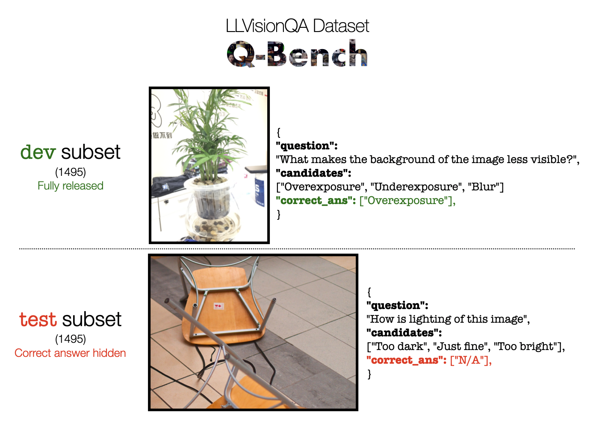

# Data Release

We release our datasets in [huggingface datasets](https://huggingface.co/datasets/). 


### A1: LLVisionQA (Perception)

Specifically, for methods to improve their low-level ability, we split the datasets into two-halves: the `dev` subset, and the `test` subset, with release information shown as follows:



The respective images are in the `images.tar` under the huggingface [repository](https://huggingface.co/datasets/nanyangtu/LLDescribe), as well as the json files for `dev` and `test` subsets.


## A2: LLDescribe (Description)

Only images are released in `images.tar`. Please refer [here](https://huggingface.co/datasets/nanyangtu/LLDescribe) to download them.


## Contact

Please contact any of the first authors of this paper for queries.

- Haoning Wu, `haoning001@e.ntu.edu.sg`, @teowu
- Zicheng Zhang, `zzc1998@sjtu.edu.cn`, @zzc-1998
- Erli Zhang, `ezhang005@e.ntu.edu.sg`, @ZhangErliCarl

## Citation

If you find our work interesting, please feel free to cite our paper:

```bibtex
@article{wu2023qbench,
    title={Q-Bench: A Benchmark for General-Purpose Foundation Models on Low-level Vision},
    author={Wu, Haoning and Zhang, Zicheng and Zhang, Erli and Chen, Chaofeng and Liao, Liang and Wang, Annan and Li, Chunyi and Sun, Wenxiu and Yan, Qiong and Zhai, Guangtao and Lin, Weisi},
    year={2023},
}
```
